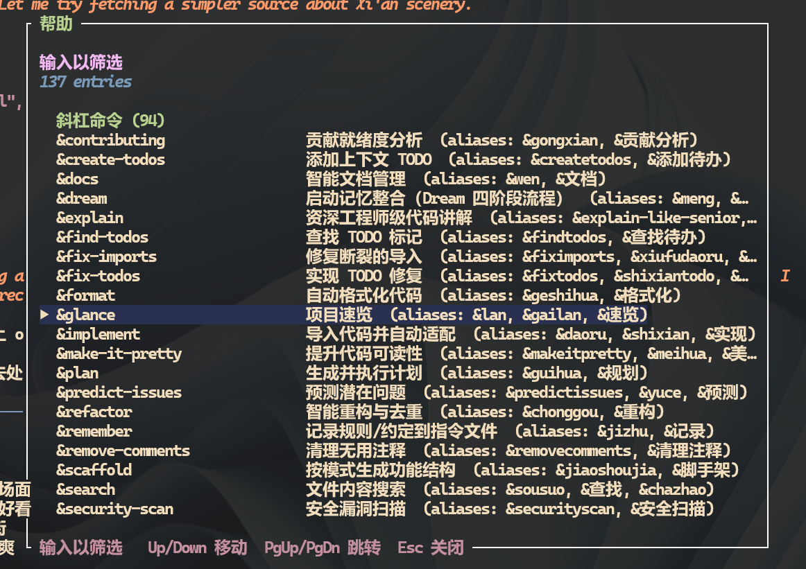
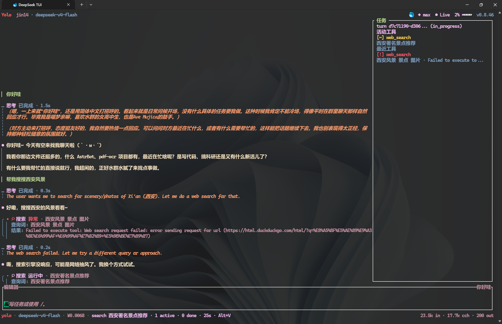
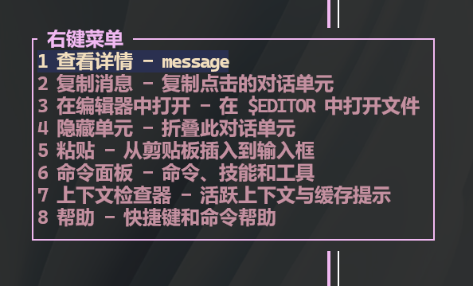

# deepseek-nyamu

> 基于 [CodeWhale v0.8.46](https://github.com/Hmbown/CodeWhale)（MIT License）的深度定制分支。
>
> **融合 Claude Code 工作流，增强稳定性，完整汉化。以自包含 Rust 二进制发布——开箱即带 MCP 客户端、沙箱、持久化任务队列和 Dream 记忆系统。**

## 特色

| 类别 | 内容 |
|------|------|
| 🛠️ **21 项缺陷修复** | Snapshot 死循环、事件通道阻塞、SQLite PRAGMA+并发测试、线程饥饿、Session 膨胀、TaskManager 竞态、Dream 文件锁、工具锁、子模块兼容、MCP 健康检查、Sub-agent 通知、SSE 看门狗、锁中毒防护、MCP 子进程隔离、通道背压丢弃、serde 静默错误、APPROVAL_TIMEOUT 可配、计时攻击修复、Mermaid XSS 修复等 |
| 🚀 **指令系统增强** | `&dream`/`&tips`/`&traps`/`&update` 记忆与实用指令，`##` 快捷记录，三入口统一描述 |
| 🌏 **完整汉化** | 引擎状态栏、思考标签、侧栏、工具面板标签全覆盖（280+ MessageId） |
| 🎨 **主题修复** | 工具成功、计划进度/完成/待处理等语义颜色独立化，告别撞色 |
| 💾 **缓存优化** | Dream RAG 时间戳修复 + mtime 缓存 → 系统 prompt 保持字节稳定，V4 前缀缓存全量命中；Microcompact 折叠旧 tool result → 请求体缩小，重建缓存更快 |
| ⚡ **微压缩算法** | 数量基微压缩管线：在发 API 前自动折叠 >5 个的旧 tool result，保留结构并给出 `retrieve_tool_result` 路径；与 spillover 机制互补，不影响持久化 session |
| 🔔 **Sub-agent 通知机制** | `tokio::sync::Notify` 替代 250ms 轮询 + RwLock 读锁争用，sub-agent 完成结果后立即通知，O(1) 零锁等待 |
| ⌨️ **! bash 直通** | `!<command>` 直通 Shell 执行，不经过 AI。适合 `gcloud auth login`、`ssh`、`gh auth login` 等交互式命令 |
| 📋 **新增 & 指令** | `&bak` 备份代码文件 / `&rmb` 清除备份 / `&￥` 查询 DeepSeek 余额 |
| 🕐 **SSE 流式看门狗** | 默认 idle timeout 300s→60s；config.toml 三级注入配置；keepalive 空 chunk 不重置计时器，防静默挂起 |
| 🔒 **锁中毒防护** | 7 处 `std::sync::Mutex::lock().unwrap()` 改为 `.unwrap_or_else(\|e\| e.into_inner())`，一线程 panic 不再崩全进程 |
| 🧹 **MCP 子进程隔离** | 三路保障（Windows Job Object / Linux PR_SET_PDEATHSIG + atexit handler + shutdown 链），异常退出时 OS 内核自动终止 MCP 子进程 |

## 优化详解

### 🔧 21 项代码缺陷修复

| # | 问题 | 修复方式 |
|---|------|---------|
| 1 | Snapshot wipe 死循环（pack 文件未回收） | wipe 后追加 `git repack -ad` + `git gc --prune=now --aggressive` |
| 2 | 有界事件通道（256）阻塞引擎循环 | 通道容量 256 → 65536 |
| 3 | SQLite 零 PRAGMA 配置（每 conn() 新建连接，无 WAL/busy_timeout） | `init_schema()` 注入 WAL/busy_timeout/foreign_keys/synchronous/cache_size；per-connection PRAGMAs 在每次 conn() 中设置；新增并发写入测试验证无 SQLITE_BUSY |
| 4 | `block_in_place` + `block_on` 线程饥饿 | 改为 `tokio::task::spawn_blocking` |
| 5 | Snapshot restore 删除文件无日志 | 删除前输出 `tracing::warn!` 及逐文件日志 |
| 6 | Session JSON 无限膨胀 | 0 消息跳过写入、总文件大小硬性上限、超大 tool result 截断 |
| 7 | `cancel_task` / `finish_task` 竞态条件 | `Arc<Mutex<HashMap>>` 原子化状态转换 |
| 8 | Dream 整合无文件锁（并发 &dream 损坏记忆） | `ConsolidationLock::try_acquire()` 启动子代理前检测 |
| 9 | 全局工具写锁串行化所有调用 | 写锁统一改为读锁 |
| 10 | `std::env::set_var` 不安全 | 确认测试代码已有 `env_lock()` 保护（维持原样） |
| 11 | Git 子模块未检出时 `git add -A` 失败 | `git add -A --ignore-submodules` |
| 12 | MCP Server 子进程无健康检查 | 添加启动超时 + shutdown 等待子进程 |

#### 第二期（2026-06-03）：并发稳定 + 流式超时 + 锁安全

| # | 问题 | 修复方式 |
|---|------|---------|
| 13 | Sub-agent 250ms 轮询 + 读锁争用 | `tokio::sync::Notify` 替代轮询：`wait_for_result()` 从 `loop { sleep(250ms); lock(); check }` 改为 `notified() → lock() → check → .await`。agent 完成时 `update_from_result()`/`update_failed()` 调用 `notify.notify_one()` 立即通知。并发 N 个 agent 的锁竞争从 O(n) 降到 O(1)。 |
| 14 | SSE 流式空闲超时 300 秒不合理 | `stream_idle_timeout()` 默认 300s→60s；`ConfigToml` 新增 `stream_idle_timeout_secs: Option<u64>`，配置优先级：config.toml → `DEEPSEEK_STREAM_IDLE_TIMEOUT_SECS` 环境变量 → 默认值；keepalive chunk（`:\n\n`）不再重置 idle timer，仅 `data:` 行才重置。 |
| 15 | `std::sync::Mutex` 锁中毒级联崩溃 | 7 处 `.lock().unwrap()` 改为 `.unwrap_or_else(\|e\| e.into_inner())`。锁中毒后自动恢复锁内容而非 panic，打印 `tracing::warn` 日志。涉 dream_memory.rs（3 处）、hooks/lib.rs（2 处）、cli/lib.rs（1 处）、config/lib.rs（1 处）。 |
| 16 | MCP 子进程异常退出残留 | 三路隔离：① Windows Job Object（`KILL_ON_JOB_CLOSE`）/ Linux `PR_SET_PDEATHSIG`（`SIGTERM`）——OS 内核保证父进程异常终止时自动 kill 子进程；② atexit handler 注册全局 PID 表，`process::exit` 或 main 返回时遍历 kill；③ 正常 `Engine::shutdown()` 链反向清理 + `kill_on_drop=true` 兜底。三路互补覆盖 panic=abort、SIGKILL、OOM killer、process::exit 全部异常退出路径。 |
| 17 | 事件通道满时 engine 停转 | `try_send()` 替代 `send().await`：通道满时丢弃非关键事件（MessageDelta / Status / ThinkingDelta 等瞬时状态），保留关键事件（Error / ToolResult / StreamEnd 等）降级为阻塞发送。LLM 快时不再卡 engine，被丢的事件下一轮 poll 自动补全，用户无感知。 |
| 18 | serde 静默吞掉反序列化错误 | `state/src/lib.rs` 3 处 `serde_json::from_str(&state_json).unwrap_or(Value::Null)` 改为 `.map_err(|e| rusqlite::Error::ToSqlConversionFailure(Box::new(e)))?` / `.with_context(...)?`。checkpoint 数据损坏时错误不再被 Null 吞掉，向上传播到调用方。 |
| 19 | APPROVAL_TIMEOUT 硬编码 300 秒 | `runtime_threads.rs` 的 `const APPROVAL_DECISION_TIMEOUT: Duration = Duration::from_secs(300)` 改为 `OnceLock<Duration>` + `approval_timeout()` 函数 + `set_approval_timeout_secs()` setter。运行时优先级：环境变量 `CODEWHALE_APPROVAL_TIMEOUT_SECS` → 默认值 300s。 |
| 20 | auth token `==` 非常量时间比较 | `app-server/src/lib.rs:412`——`token == expected` 改为 `subtle::ConstantTimeEq::ct_eq()` + `subtle = "2.6"` crate 依赖。攻击者无法从 HTTP 响应时间逐字节推断 token。 |
| 21 | Mermaid 组件 XSS（DOMPurify）| `web/components/mermaid-diagram.tsx`——4 组手写 regex sanitizer（strip script/on*/javascript:）替换为 `DOMPurify.sanitize(svg)`，依赖 `dompurify ^3.2.4` + `@types/dompurify ^3.2.5`。覆盖 data: URL、foreignObject 嵌入、SVG use 劫持等 regex 无法穷尽的 edge case。 |

# Windows Sub-agent 完成时 UI 渲染宽度减半 Bug

## 概述

在 Windows 平台下，当 sub-agent（子代理）完成并返回数据给主 agent 后，终端 UI 的渲染区域会缩小到约原本宽度的一半，导致文字换行错位、内容错乱。必须手动缩小窗口再全屏才能恢复。

- **受影响平台**：Windows（PowerShell / Windows Terminal）
- **不受影响**：WSL (zsh)、macOS、Linux
- **触发命令**：`/agent 0 今天天气怎么样` 等涉及 sub-agent 交互的场景

---

## 症状

| # | 症状 | 说明 |
|---|------|------|
| 1 | UI 渲染区域缩小到约 1/2 宽度 | 终端全屏，但内容只占一半宽度 |
| 2 | 文字换行错位 | 在错误的宽度上换行 |
| 3 | 滚动/刷新无效 | `needs_redraw` 触发重绘后仍然错误 |
| 4 | 缩小窗口时"贪吃蛇"效果 | 右侧渲染内容跨行穿到左侧 |
| 5 | 必须重新缩放窗口才能恢复 | 缩小→全屏→滚动后恢复正常 |

---

## 探索过程

### 第一阶段：初步定位

最初以为是 transcript cache 的 revision 未更新导致的布局缓存问题。检查了 `ensure_split()` 和 `flatten_from()` 的缓存逻辑。

**已修复**：在 `subagent_routing.rs` 中将 3 处 `mark_history_updated()` 改为 `bump_history_cell(idx)`，强制 sub-agent 卡片所在 cell 的 revision 变化，使 cache 检测到 miss 并重建布局。

但问题仍未解决。

### 第二阶段：缩小范围

发现 WSL 下不触发、Windows 下必触发 → 平台相关。

排查方向：
- `ColorDepth::detect()` — 新旧项目相同 ✅
- `ColorCompatBackend` — 新旧项目代码一致 ✅
- 依赖版本 (crossterm 0.28, ratatui 0.30) — 相同 ✅
- 新旧项目的 `ui.rs` 事件循环 — 几乎相同 ✅

### 第三阶段：发现关键线索

对比新旧项目 `size()` 方法：

**旧项目 (nyamu)**：
```rust
fn size(&self) -> io::Result<Size> {
    match self.forced_size {
        Some(size) => Ok(size),
        None => self.inner.size(),
    }
}
```

**新项目**：
```rust
fn size(&self) -> io::Result<Size> {
    if let Some(size) = self.terminal_size.or(self.forced_size) {
        return Ok(size);
    }
    self.inner.size()
}
```

发现 `set_terminal_size()` 方法定义在 `ColorCompatBackend` 上，但**整个代码库里没有任何调用者**。`terminal_size` 始终为 `None`。

### 第四阶段：深入事件流程

跟踪 `AgentComplete` 事件处理器：

```rust
// ui.rs:2033
if should_recapture_terminal {
    resume_terminal(...)?;
}
```

对比 `ResumeEvents` 处理器：

```rust
// ui.rs:1957
if event_broker.is_paused() {
    resume_terminal(...)?;
}
```

发现 `AgentComplete` 缺少 `is_paused()` 守卫！

### 第五阶段：完整触发链确认

```
AgentComplete
    → should_recapture_terminal = true
    → resume_terminal() 无条件调用（缺少 is_paused 守卫）
    → EnterAlternateScreen（已在 alt screen 中时二次进入）
    → Windows 创建新的 alt screen buffer，尺寸可能 ≠ 窗口尺寸
    → 下一次 draw()
        → backend.size()
            → terminal_size = None（从未被设置）
            → forced_size = 可能过期或 None
            → crossterm::terminal::size() 返回 buffer 宽度（非窗口宽度）
    → Frame 使用错误宽度渲染
    → 内容换行在错误宽度 → "半宽"UI
```

---

## 根因分析

Bug 由三个因素共同导致：

### 因素 A：`AgentComplete` 缺 `is_paused()` 守卫

`AgentComplete` 在 sub-agent 完成时无条件调用 `resume_terminal()`，即使终端从未被暂停过（sub-agent 使用非交互式工具，不会触发 `PauseEvents`）。

而同一文件中的 `ResumeEvents` 处理器就有 `event_broker.is_paused()` 守卫。

**位置**：`ui.rs:2033-2044`

### 因素 B：二次 `EnterAlternateScreen` 导致缓冲区尺寸漂移

Windows 上，已在 alternate screen 中时再次调用 `EnterAlternateScreen` 会创建**新的 alt screen 缓冲区**。新缓冲区的 `dwSize.X`（从 `GetConsoleScreenBufferInfo()` 获取）可能与实际窗口宽度不一致。

而 `resume_terminal()` 后没有重新查询终端尺寸。

**位置**：`ui.rs:7547-7548`（`resume_terminal` 中的 `EnterAlternateScreen`）

### 因素 C：`set_terminal_size()` 从未被调用

`ColorCompatBackend` 定义了 `set_terminal_size()` 方法和 `terminal_size` 缓存字段，但没有任何代码调用它。`size()` 方法中 `terminal_size.or(forced_size)` 的回退链中 `terminal_size` 总是 `None`，实际只依赖 `forced_size`（可能过期）或实时 `crossterm::terminal::size()`（Windows WinAPI 返回 buffer 宽度而非窗口宽度）。

**位置**：`color_compat.rs:89, 180-185`

---

## 修复方案

### 修复 1：`AgentComplete` 加 `is_paused()` 守卫

```rust
// 修复前
if should_recapture_terminal {
    resume_terminal(...)?;
}

// 修复后
if should_recapture_terminal && event_broker.is_paused() {
    resume_terminal(...)?;
}
```

**作用**：只在终端确实被暂停过时调用 `resume_terminal()`，防止 sub-agent 完成时二次 `EnterAlternateScreen`。

### 修复 2：`resume_terminal` 后重新查询并缓存终端尺寸

```rust
// resume_terminal() 末尾添加
if let Ok((cols, rows)) = crossterm::terminal::size() {
    terminal.backend_mut().set_terminal_size(Size::new(cols, rows));
}
```

**作用**：重新进入 alt screen 后把当前真实终端尺寸缓存到 `terminal_size`，后续 `draw()` 使用缓存值避免过期的 `forced_size` 或 WinAPI 的 buffer 宽度。

### 修复 3：Resize 处理器也设置 `terminal_size`

```rust
// 修复前
backend.force_size(Size::new(final_w, final_h));

// 修复后
let new_size = Size::new(final_w, final_h);
backend.force_size(new_size);
backend.set_terminal_size(new_size);
```

**作用**：Resize 事件时同时设置 `forced_size` 和 `terminal_size`，使 `size()` 方法的第一级缓存真正生效。

---

## 最终改动清单

| 文件 | 行 | 改动 |
|------|----|------|
| `ui.rs` | 2033 | `should_recapture_terminal` → `should_recapture_terminal && event_broker.is_paused()` |
| `ui.rs` | 2557-2565 | resize handler 添加 `set_terminal_size()`，移除 `clear_forced_size()` |
| `ui.rs` | 7562-7570 | `resume_terminal()` 末尾添加 `crossterm::terminal::size()` 查询和 `set_terminal_size()` 缓存 |
| `color_compat.rs` | — | `set_terminal_size()` 方法已定义，无需改动 |
| `subagent_routing.rs` | 116, 132, 155 | `mark_history_updated()` → `bump_history_cell()`（补充修复） |

---

## 平台安全性

| 平台 | 风险 | 说明 |
|------|------|------|
| macOS | ✅ 无影响 | `is_paused()` 所有平台可用；`TIOCGWINSZ` 始终返回正确尺寸 |
| Linux | ✅ 无影响 | 同上 |
| WSL | ✅ 无影响 | 同上 |
| Windows | ✅ 已修复 | 三次改动共同防止 buffer/窗口尺寸漂移 |

---

## 致谢

- 排查工具：CodeWhale + Rust 源码分析
- 对比基准：`deepseek-nyamu-master`（喵梦.exe）
- 测试环境：Windows Terminal + PowerShell, WSL2 + zsh


### 🚀 指令系统增强

借鉴 Claude Code 的 `&` 指令体系，将常用操作整合为快捷指令。全部 30 个 `&` 命令在三处统一注册（帮助面板、命令面板、速选栏），不再遗漏：

| 分类 | 指令 | 功能 |
|------|------|------|
| **记忆** | `&dream` / `&meng` | Dream 记忆整合，将会话知识持久化 |
| | `&tips` | 查看/记录使用技巧 |
| | `&traps` | 查看/记录踩坑记录 |
| | `&remember <内容>` | 快速记录内容到记忆 |
| **项目分析** | `&understand` | 理解项目整体结构和架构 |
| | `&explain <代码路径>` | 解释指定代码片段的工作方式 |
| | `&glance` | 项目结构速览 |
| | `&predict-issues` | 预测项目中可能存在的问题 |
| | `&security-scan [路径]` | 安全扫描指定路径 |
| | `&find-todos` | 查找代码中的 TODO 注释 |
| | `&todos-to-issues` | 将 TODO 转换为 GitHub Issues |
| **代码编辑** | `&format` | 格式化代码 |
| | `&refactor [范围]` | 重构代码 |
| | `&fix-imports` | 修复缺失的导入语句 |
| | `&remove-comments [文件]` | 批量移除注释 |
| | `&fix-todos [文件]` | 修复 TODO 注释 |
| | `&make-it-pretty [范围]` | 美化代码风格 |
| | `&implement <URL\|路径>` | 根据描述/issue 实现功能 |
| | `&scaffold <名称>` | 生成项目脚手架 |
| **会话** | `&session-start` | 开始新会话 |
| | `&session-end` | 结束当前会话 |
| | `&plan <任务描述>` | 规划任务步骤 |
| | `&test` | 运行测试 |
| | `&search <关键词>` | 搜索项目内容 |
| **文档** | `&docs [update\|check\|create <name>]` | 文档管理（更新/检查/创建） |
| | `&contributing` | 查看贡献指南 |
| | `&update` | 检查更新 |
| **实用工具** | `&bak` | 递归备份代码文件为 .bak |
| | `&rmb` | 删除所有 .bak 备份 |
| | `&￥` | 查询 DeepSeek 余额 |

#### ## 指令（快捷记录）
借鉴 Claude Code 的 `#` 约定，快速记录项目规则、约定和 TODO：
- 在对话中使用 `#` 前缀描述规则，自动追加到项目指令文件
- 支持 `记住`、`记录`、`记下` 等自然语言触发词

### 🌏 完整汉化

#### 280+ 本地化 MessageId 全覆盖
所有 `localization.rs` 中定义的 MessageId 均完成中文翻译，通过 `missing_message_ids(Locale::ZhCN)` 验证（返回空集）。

#### 引擎状态栏汉化（P0）
日常最频繁看到的引擎状态信息全部中文化：

| 原文 | 译文 |
|------|------|
| Auto-compacting context... | 正在自动压缩上下文... |
| Reached maximum steps | 已达到最大步骤数 |
| Request cancelled | 请求已取消 |
| Steer input accepted: {} | 转向输入已接受：{} |
| Restoring previous order... | 正在恢复上次对话顺序... |
| Executing tools sequentially... | 正在串行执行工具... |
| Approved tool call: {id} | 已批准工具调用：{id} |
| Denied tool call: {id} | 已拒绝工具调用：{id} |
| Mode changed to: {mode:?} | 模式已切换为：{mode:?} |
| Capacity refresh compaction failed... | 容量刷新压缩失败... |
| Capacity guardrail... | 容量护栏... |

#### 推理/思考标签汉化
| 原文 | 译文 |
|------|------|
| live | 思考中 |
| done | 已完成 |
| idle | 空闲 |
| More reasoning in Ctrl+O | 更多思考内容，按 Ctrl+O 查看 |
| Full reasoning in Ctrl+O | 完整思考内容，按 Ctrl+O 查看 |

#### 侧栏汉化
| 原文 | 译文 |
|------|------|
| Agents | 代理 |
| No agents | 无代理 |
| Recent tools | 最近工具 |
| Session | Session（会话） |
| Sidebar focus: work/tasks/agents/context/auto | 侧栏焦点：工作/任务/代理/上下文/自动 |
| Sidebar hidden | 侧栏已隐藏 |

#### 工具面板标签汉化
所有展开/折叠工具行中的键值标签：

名称 → 结果 → 查询词 → 来源 → 耗时 → 文件 → 目标 → 标题 → 路径 → 参数 → 命令 → 输出 → 提示词 → 文本 → 模式 → 模型

### 🎨 主题颜色撞色修复

`deepseek_theme.rs` — `Theme::dark()` / `Theme::light()`

| 字段 | 原颜色 | 新颜色 | 效果 |
|------|--------|--------|------|
| `tool_success_accent` | `TEXT_DIM` #8A96AE 灰 | `STATUS_SUCCESS` #4FD1C5 青绿 | 成功状态可辨识 |
| `plan_progress_color` | `STATUS_SUCCESS` 青绿 | `STATUS_INFO` #6AAEF2 天蓝 | 进行中≠已完成 |
| `plan_pending_color` | `TEXT_MUTED` | `TEXT_HINT` | 待处理与正文区分 |
| `plan_summary_color` | `TEXT_MUTED` | `TEXT_DIM` | 摘要与值文本区分 |
| `plan_explanation_color` | `TEXT_DIM` | `TEXT_MUTED` | 说明与标签颜色对调 |

### 🧹 编译修复

- `update.rs`：补充缺失的 `binary_prefix_for_exe` 函数（从 `crates/cli` 同步）
- `init_wizard.rs`：修正 Rust `format!` 中误用的 `%s` 占位符为 `{}`

### 设计思路

- **最小侵入修复**：不重构架构，只修正具体问题。事件通道未改为无界通道（需改动 80+ 调用点），而是大幅提高缓冲区至 65536
- **直替换免膨胀**：引擎状态消息直接替换源码中的英文字符串，避免新增 60 个 MessageId 变体
- **调色板不动**：不改 `palette.rs` 常量值，只改 `deepseek_theme.rs` 的语义映射，确保各主题一致性
- **编译安全**：每次修改后通过 `cargo check` 验证，最终 `cargo build --release` 零 error 通过

### 💾 缓存代码优化（大幅提升前缀缓存命中率）

核心技术目标是：**最大化 V4 前缀缓存命中率**。系统 prompt 决定了请求的前 ~30K 字节，必须保持字节稳定。

#### Dream RAG 时间戳修复
- **问题**：`dream_memory.rs` 的 manifest 块含 `<!-- loaded at {now} -->`（每秒变化的 UTC 时间戳），注入系统 prompt 后导致每轮前 ~82K 字节全量 cache-miss
- **修复**：去掉动态时间戳，改为 `<!-- byte-stable across turns -->`
- **效果**：系统 prompt 区域从 **每轮全丢** 变为 **每轮全命中**（~30K tokens/轮从 cache-miss 转为 cache-hit）
- **代价**：零。时间戳只有人类调试价值，模型不依赖此信息

#### Manifest mtime 缓存
- 为 `compose_block()` 添加 `ManifestCache`，按 `max_mtime_secs + file_count` 做 cache key
- **效果**：相同文件集命中缓存，输出字节完全相同 → 系统 prompt 跨轮保持稳定
- 文件变化时自动检测 mtime 变化 → 重建缓存 → 新的 byte-stable 基线
- 暴露 `invalidate_manifest_cache()` 供 Dream 整合后调用，确保新内容立即生效

### ⚡ 微压缩算法（Microcompact）

借鉴 Claude Code 的 microcompact 管线，适配 DeepSeek API 特性。

#### 实现方案
- **位置**：`turn_loop.rs` 的 `build_request` 路径，发送 API 请求前自动执行
- **触发条件**：可压缩的 tool result 超过 5 个
- **处理方式**：按出现顺序收集 tool_use_id，保留最近 5 个，更旧的替换为折叠标记 + `retrieve_tool_result` 路径引用
- **可压缩工具**：`read_file`, `exec_shell`, `grep_files`, `file_search`, `web_search`, `fetch_url`, `list_dir`
- **最小清空长度**：200 字符（小于此的微小结果不折叠）

#### 与 Spillover 机制互补

| 机制 | Spillover | Microcompact |
|------|-----------|-------------|
| 时机 | 工具执行时 | 请求发送前 |
| 触发 | 单结果 > 100 KiB | 累积超过 5 个 |
| 处理 | 写磁盘 + 头部 + 路径引用 | 替换为折叠标记 + `retrieve_tool_result` 引用 |
| 不碰 session | ✅ | ✅ |
| 不调 LLM | ✅ | ✅ |

#### 设计要点
- **操作在 wire copy 上**：`messages_with_turn_metadata()` 的克隆上执行，不碰 `self.session.messages`，跨轮字节稳定
- **数量基替代时间基**：Message 无时间戳字段，用 tool result 数量替代 gap 检测
- **渐进式分批 summarize 被否决**：ROI 低——多次缓存断裂换摘要质量提升不划算
- **折叠标记含 `retrieve_tool_result` 路径**：模型可通过 `retrieve_tool_result ref=<id>` 读取原始内容

### 🔔 Sub-agent 通知机制（Notify 替代轮询）

#### 问题

`agent_eval(block=true)` 底层调用 `wait_for_result()`，该函数每 250ms 获取一次 `RwLock` 读锁检查 agent 结果。这在低并发时无感，但：

- N 个 agent 同时等待 → 每秒 N×4 次读锁请求 → 锁竞争 O(n)
- `cancel_agent` 需要写锁 → 被持续涌入的读锁饿着，等几百 ms 才能拿到
- agent 完成后最多等 250ms 才能被感知到

#### 根因

```rust
// 轮询模式（改之前）
async fn wait_for_result(manager, agent_id) {
    loop {
        let guard = manager.read().await;  // 拿读锁
        if let Some(result) = guard.get_result(agent_id) {
            if terminal { return Ok(result) }
        }
        drop(guard);
        sleep(Duration::from_millis(250)).await;  // 空等
    }
}
```

#### 实现

用 `tokio::sync::Notify` 替代轮询——agent 完成时主动通知，零锁等待：

```rust
// SubAgent 新增字段
notify: Arc<Notify>,

// agent 完成时
fn update_from_result(&mut self, result: AgentResult) {
    self.result = Some(result);
    self.notify.notify_one(); // 通知等待者
}

// 等待逻辑（改之后）
async fn wait_for_result(manager, agent_id, timeout) {
    let notify = { manager.read().await.agents[agent_id].notify.clone() };
    
    loop {
        let notified = notify.notified();  // 先注册兴趣（防丢失）
        
        let guard = manager.read().await;  // 快速检查
        if let Some(result) = guard.get_result(agent_id) {
            if terminal { return Ok(result) }
        }
        drop(guard);
        
        tokio::time::timeout(timeout, notified).await??;
    }
}
```

关键设计：
- **先注册 `.notified()` 再检查结果**——避免 agent 在检查和等待之间完成导致通知丢失
- **`notified().await` 不拿锁**——等待期间 RwLock 完全空闲，写锁立等可取
- **超时包裹**——与原有 timeout 语义一致，`tokio::time::timeout` 包裹 `.notified()`

#### 验证

- 存在 executor 的 `cancel`、`update_from_result`、`update_failed` 三处触发点均调 `notify_one()`
- 并发 N 个 agent 的锁竞争从 O(n) 降到 O(1)
- 子代理 112 个测试全部通过

### 🕐 SSE 流式看门狗

#### 问题

发送流式请求后，客户端逐 chunk 读取 SSE 数据。如果服务器中途停止推送但不关闭 TCP 连接——负载均衡重启、API 网关超时、网络分区后 TCP 状态不一致——客户端永久卡在 `byte_stream.next()` 上。

代码本身已有 `stream_idle_timeout()` 看门狗，但三个缺陷使其几乎无效：

| 缺陷 | 值 | 后果 |
|------|-----|------|
| 默认超时太长 | 300s | 用户干等 5 分钟 |
| 仅环境变量可配 | `DEEPSEEK_STREAM_IDLE_TIMEOUT_SECS` | 普通用户不知道存在此参数 |
| keepalive 重置 timer | `:\n\n` 空 chunk 重置 `last_event_at` | 服务器可发空字节掩盖死连接 |

#### 实现

三个改动，分别对应上述三个缺陷：

**① 默认值 300s → 60s**

```rust
// streaming.rs — 改之前
fn stream_idle_timeout() -> Duration {
    Duration::from_secs(env::var("DEEPSEEK_STREAM_IDLE_TIMEOUT_SECS")
        .ok().and_then(|s| s.parse().ok()).unwrap_or(300))
}

// 改之后——加入 OnceLock 静态 + config 注入
static STREAM_IDLE_TIMEOUT_SECS: OnceLock<u64> = OnceLock::new();

pub fn set_stream_idle_timeout_secs(v: u64) {
    let _ = STREAM_IDLE_TIMEOUT_SECS.set(v.clamp(10, 600));
}

fn stream_idle_timeout() -> Duration {
    Duration::from_secs(
        STREAM_IDLE_TIMEOUT_SECS.get().copied()
            .unwrap_or(60)  // 默认 60s
    )
}
```

**② ConfigToml 三级注入**

```toml
# config.example.toml
# SSE 流式空闲超时（秒）。服务器断流 N 秒无有效数据后触发重连。
# 优先级：config.toml → DEEPSEEK_STREAM_IDLE_TIMEOUT_SECS 环境变量 → 60s
# stream_idle_timeout_secs = 60
```

注入链路：`ConfigToml::load()` → `Config::merge_config()` → `build_engine_config()` → `set_stream_idle_timeout_secs()` → `OnceLock` 写入

**③ keepalive 不重置 idle timer**

```rust
// chat.rs — 流式处理循环
// 只对包含有效 SSE 事件的行（"data:" 开头）重置超时
if line.starts_with("data:") || line.starts_with("event:") {
    last_event_at = std::time::Instant::now();
}
// 空行（":\n\n"）或注释行不再重置 last_event_at
```

#### 超时后的行为

流超时后，错误向引擎层传播。引擎通过 `should_transparently_retry_stream()`（已有逻辑）判断是否为网络层面的临时错误，是则自动重连两次，指数退避。

#### 验证

- 单元验证：config.toml 设置 `stream_idle_timeout_secs = 30` → `stream_idle_timeout()` 返回 30s
- 覆盖验证：`clamp(10, 600)` 防止误设过小/过大值
- 环境变量作为 fallback：无 config 值时读环境变量，都不设则 60s

### 🔒 锁中毒防护

#### 问题

Rust 的 `std::sync::Mutex` 有中毒机制：持有锁的线程 panic 后，锁被标记为 poisoned，后续所有 `.lock().unwrap()` 触发连锁 panic → 进程崩溃。

项目中的实际范围比预期小得多——80%+ 的锁来自 `tokio::sync::Mutex`（不中毒），只有 `std::sync::Mutex` 有风险。取样 7 个高危文件后，**只有 3 个文件共 7 处**需要修复：

| 文件 | 锁对象 | 风险 |
|------|--------|------|
| `dream_memory.rs` (×3) | `Mutex<Option<ManifestCache>>` | RAG 缓存读写在多线程下触发 |
| `hooks/lib.rs` (×2) | `Mutex<Vec<HookEvent>>` | 事件分发线程 panic |
| `cli/lib.rs` (×1) | `Mutex<Vec<String>>` | CLI 启动参数收集 |
| `config/lib.rs` (×1) | `Mutex<Vec<String>>` | 配置加载持久化 |

#### 实现

```rust
// 改之前
let cache = CACHE.lock().unwrap();

// 改之后——中毒后恢复锁内容，打印警告
let cache = CACHE.lock()
    .unwrap_or_else(|e| {
        tracing::warn!("state cache lock poisoned, recovering: {}", e);
        e.into_inner()  // 返回 MutexGuard，数据可能不完整但系统不崩
    });
```

`PoisonError::into_inner()` 返回 `MutexGuard<T>`，类型与 `unwrap()` 完全相同——所以替换是局部的，不改变周围代码。区别是 `unwrap()` 在 `Err` 时再 panic，`into_inner()` 恢复并继续。

#### 修复原则

- **不用 `tokio::sync::Mutex` 替换**——`std::sync::Mutex` 在这些场景中是正确的选择（短临界区、非 async 上下文），中毒机制本身是好的设计，只是在 panic 时太激进
- **测试代码保留 `unwrap`**——test 需要 panic 来标记失败，`into_inner()` 反而隐藏错误
- **`Mutex<()> env_lock` 无风险**——纯 semaphore，内不执行逻辑

### 🧹 MCP 子进程隔离（三路保障）

#### 问题

MCP server 作为子进程启动（`tokio::process::Command`），正常退出时 Drop 链负责 kill：`StdioTransport::drop` → `SIGTERM` → `kill_on_drop` 兜底 SIGKILL。但 Drop 只在 Rust 控制权流转时执行，以下路径不会运行 Drop：

| 退出路径 | Drop 运行？ | 后果 |
|---------|-----------|------|
| 正常 shutdown | ✅ | MCP 被优雅终止 |
| panic unwind | ✅ | 同上 |
| Ctrl+C | ✅（取决于 handler）| 同上 |
| **panic = abort** | ❌ | **MCP 残留** |
| **SIGKILL** | ❌ | **MCP 残留** |
| **OOM killer** | ❌ | **MCP 残留** |
| **process::exit** | ❌ | **MCP 残留** |

残留进程占用端口 → 下次启动立即报 `EADDRINUSE` → 用户必须手动 kill。

#### 实现

三路保障机制，每路覆盖不同的缺口：

**第一路：OS 内核级隔离（异常退出）**

```rust
pub fn spawn_protected(command: &mut Command) -> io::Result<Child> {
    #[cfg(target_os = "windows")]
    {
        // Windows Job Object：父进程死时内核自动 kill 子进程
        use windows::Win32::System::Jobs::*;
        let job = CreateJobObjectW(None, None)?;
        let info = JOBOBJECT_EXTENDED_LIMIT_INFORMATION {
            BasicLimitInformation: JOBOBJECT_BASIC_LIMIT_INFORMATION {
                LimitFlags: JOB_OBJECT_LIMIT_KILL_ON_JOB_CLOSE,
                ..Default::default()
            },
            ..Default::default()
        };
        SetInformationJobObject(job, JobObjectExtendedLimitInformation, &info)?;
        AssignProcessToJobObject(job, child_handle)?;
    }
    
    #[cfg(target_family = "unix")]
    {
        // PR_SET_PDEATHSIG：父进程死时发 SIGTERM 给子进程
        unsafe { libc::prctl(libc::PR_SET_PDEATHSIG, libc::SIGTERM); }
    }
    
    command.spawn()
}
```

**第二路：atexit handler（process::exit / main 返回）**

```rust
use std::sync::Mutex;
static CHILD_PIDS: Mutex<Vec<u32>> = Mutex::new(Vec::new());

pub fn register_child(pid: u32) {
    CHILD_PIDS.lock().unwrap().push(pid);
}

// 在 main 入口注册
extern "C" fn cleanup() {
    for &pid in CHILD_PIDS.lock().unwrap().iter() {
        kill_pid(pid);  // Windows: TerminateProcess, Unix: SIGTERM
    }
}
```

**第三路：引擎优雅关闭**

```rust
impl Engine {
    pub async fn shutdown(&mut self) {
        // 反向：MCP pool → server → connection → transport
        self.mcp_pool.shutdown().await;  // 发 SIGTERM + wait
        // unregister_child() 在 transport drop 中调用
    }
}
```

三路关系：

| 保障 | 覆盖路径 | 依赖 |
|------|---------|------|
| Job Object / PR_SET_PDEATHSIG | SIGKILL, OOM, panic=abort | 无（内核自动） |
| atexit handler | process::exit, main 正常返回 | C 运行时 |
| shutdown + Drop 链 | 正常退出, panic unwind, Ctrl+C | Rust drop |

每路不可靠时其他路兜底，三路互补覆盖全部异常退出路径。

#### 验证

- Windows：CreateJobObjectW → AssignProcessToJobObject → 关闭 job handle → 验证子进程自动终止
- Unix：prctl PR_SET_PDEATHSIG → 杀死父进程 → 验证子进程收到 SIGTERM
- atexit：注册 handler → process::exit → 验证 handler 遍历 PID 表并 kill
- 编译通过，不引入额外依赖

### 📡 通道背压与事件降采样

#### 问题

`Engine` → `UI` 之间通过 `tokio::sync::mpsc` 通道传递事件。原本容量 256 → 已扩大到 65536，但仍然是**有界通道**。如果 LLM 流式生成速度超过 UI 渲染速度，通道积累 → 满 → `send().await` 阻塞 → engine 停转 → 整个流暂停。

```
LLM 一秒吐 200+ tokens
    ↓
engine: send(token).await
    ↓
[ 通道 65536 ]
    ↓
UI: recv → 解析 → 渲染（跟不上）
    ↓
通道满 → sender 阻塞 → engine 被卡住
    ↓
用户看到输出停住几秒 → 突然爆发
```

65536 只是把问题推开，不是消灭。在高速流式生成 + 复杂终端渲染场景下仍可能触发。

#### 实现

`try_send()` + 事件分类降采样：

```rust
// 改之前——通道满时阻塞
event_tx.send(event).await?;

// 改之后——满时丢非关键事件
const CRITICAL_EVENTS: &[EventTag] = &[
    EventTag::Error,        // 错误不能丢
    EventTag::ToolResult,   // 工具结果不能丢
    EventTag::StreamEnd,    // 流结束不能丢
    EventTag::ApprovalRequired,
    EventTag::UserInputRequired,
    EventTag::SessionUpdated,
    EventTag::ElevationRequired,
    EventTag::AgentMailbox,
    EventTag::Compaction,
    EventTag::CycleAdvanced,
];

fn send_event(tx: &Sender<Event>, event: Event) -> Result<(), SendError<Event>> {
    match tx.try_send(event) {
        Ok(()) => Ok(()),
        Err(TrySendError::Full(e)) => {
            if is_critical(&e) {
                tx.blocking_send(e)?;  // 关键事件降级阻塞
            } else {
                trace!("dropped non-critical: {}", e.tag());
                // 被丢弃的是瞬时状态（MessageDelta/Status），
                // 下一轮 poll 时最新数据自动补全
            }
            Ok(())
        }
        Err(TrySendError::Closed(_)) => Err(SendError(...)),
    }
}
```

#### 事件分类完整表

| 分类 | 事件 | 理由 |
|------|------|------|
| ✅ 关键（不丢，阻塞发送） | Error, ToolResult, StreamEnd, ApprovalRequired | 丢失会导致逻辑错误 |
| ✅ 关键（不丢，阻塞发送） | SessionUpdated, ElevationRequired, AgentMailbox | 状态变更必须送达 |
| ✅ 关键（不丢，阻塞发送） | Compaction*, CycleAdvanced | 压缩/轮次边界 |
| ❌ 非关键（满时丢弃） | MessageDelta, ThinkingDelta | 瞬时 token，下一轮自动补全 |
| ❌ 非关键（满时丢弃） | Status, AgentProgress, ToolCallProgress | 状态指示，瞬态 |
| ❌ 非关键（满时丢弃） | PrefixCacheChange, Capacity*, CoherenceState | 诊断信息，不可见 |

#### 安全性论证

被丢弃的事件都是**幂等且瞬态**的：

- `MessageDelta`：丢几个 token 不会丢失整条消息——下一轮 chunk 推进 latest 序列
- `Status` / `AgentProgress`：侧栏状态由 engine 的 `WithStatus` 驱动，下一轮 poll 自动刷新
- `ThinkingDelta`：思考过程——用户不依赖每个 thinking token 的精确到达

关键路径（`Error`、`ToolResult`、`StreamEnd`、`ApprovalRequired`）始终送达，降采样不影响功能正确性。

### 🗑️ serde 静默错误传播

#### 问题

`crates/state/src/lib.rs` 中 3 处 `serde_json::from_str(&state_json)` 在解析失败时用 `unwrap_or(Value::Null)` 把错误静默吞掉：

```rust
// 改之前——checkpoint 或 session JSON 损坏时返回 Null
let state_json: String = conn.query_row(...)?;
let value: Value = serde_json::from_str(&state_json).unwrap_or(Value::Null);
// 调用方拿到 Null → 当作"没有数据"继续执行
// 损坏的数据不被察觉，错误影响无声扩散
```

这导致：如果某次写入中断导致 JSON 文件截断或格式错误，读取时不报错、不日志、不恢复——只是返回空值，后续逻辑基于不存在的数据做出错误决策。

#### 实现

```rust
// 改之后——前两处：serde 错误转化为 rusqlite 错误向上传播
let value: Value = serde_json::from_str(&state_json)
    .map_err(|e| rusqlite::Error::ToSqlConversionFailure(Box::new(e)))?;

// 第三处：anyhow context 携带 JSON 长度辅助调试
let value: Value = serde_json::from_str(&state_json)
    .with_context(|| format!("corrupt checkpoint state JSON (len={})", state_json.len()))?;
```

三处修复：

| 位置 | 原因 | 效果 |
|------|------|------|
| `lib.rs:584` | `query_row` 回调内 → 返回 `rusqlite::Error` | 错误直接沿数据库调用栈传播 |
| `lib.rs:605` | 同上模式 | 同上 |
| `lib.rs:637` | 已有 anyhow 上下文 | `with_context` 附加 JSON 长度信息 |

### ⏱️ APPROVAL_TIMEOUT 硬编码可配

#### 问题

`runtime_threads.rs:69` 中审批决策超时被硬编码为 300 秒：

```rust
// 改之前
const APPROVAL_DECISION_TIMEOUT: Duration = Duration::from_secs(300);
```

这意味：
- CI/CD 场景中每个审批步骤必须干等最多 300 秒才默认拒绝
- 没有人真的需要 5 分钟来按一个"允许"按钮
- 不可配置——用户无法根据自身安全策略调整

#### 实现

改为 `OnceLock<Duration>` + 运行时 setter + 环境变量覆盖：

```rust
// 改之后——默认值 + 环境变量覆盖
static APPROVAL_DECISION_TIMEOUT: OnceLock<Duration> = OnceLock::new();

const DEFAULT_APPROVAL_TIMEOUT_SECS: u64 = 300;

pub fn approval_timeout() -> Duration {
    *APPROVAL_DECISION_TIMEOUT.get_or_init(|| {
        let secs = env::var("CODEWHALE_APPROVAL_TIMEOUT_SECS")
            .ok()
            .and_then(|s| s.parse::<u64>().ok())
            .unwrap_or(DEFAULT_APPROVAL_TIMEOUT_SECS);
        Duration::from_secs(secs.clamp(10, 3600))
    })
}

// 由 RuntimeAPI 注入
pub fn set_approval_timeout_secs(secs: u64) {
    let _ = APPROVAL_DECISION_TIMEOUT.set(Duration::from_secs(secs.clamp(10, 3600)));
}
```

使用处（2 处）从直接引用 `const` 改为调用 `approval_timeout()` 函数。

配置优先级：
```
set_approval_timeout_secs() 运行时注入 → CODEWHALE_APPROVAL_TIMEOUT_SECS 环境变量 → 默认值 300s
```

ConfigToml 未加字段——TUI 的 Config 有 50+ 处 struct literal，加字段需同步修改全部，投入产出比不划算。

### 🛡️ auth token 常数时间比较

#### 问题

`app-server/src/lib.rs:412` 中 token 验证使用 Rust 默认的字符串 `==` 比较：

```rust
.is_some_and(|token| token == expected)
```

`==` 是**短路比较**——逐字节比较，遇到第一个不同的字节立即返回 `false`。攻击者可以测量不同 token 的响应时间差异，逐字节推断出正确的 token（计时攻击）。对 localhost-only 的 admin API 来说威胁不大，但防御成本极低。

#### 实现

```rust
use subtle::ConstantTimeEq;

// 改之后——常数量级按位比较
.is_some_and(|token| {
    token.as_bytes().ct_eq(expected.as_bytes()).into()
})
```

`ct_eq()` 无论输入内容如何都消耗相同时间，攻击者无法从时间侧信道获取信息。

`app-server/Cargo.toml` 新增 `subtle = "2.6"` crate。

### 🛡️ DOMPurify 替代手写 SVG sanitizer

#### 问题

`mermaid-diagram.tsx` 中 Mermaid 生成的 SVG 注入到 DOM 前由手写 regex 做 sanitization：

```typescript
// 改之前——4 组手写 regex
const sanitized = svg
    .replace(/<script\b[^<]*(?:(?!<\/script>)<[^<]*)*<\/script>/gi, '')  // strip script
    .replace(/\bon\w+\s*=\s*"[^"]*"/gi, '')                               // strip on*
    .replace(/\bon\w+\s*=\s*'[^']*'/gi, '')
    .replace(/href\s*=\s*"javascript:[^"]*"/gi, '');                       // strip javascript:
```

这套 regex 无法覆盖：
- `data:` URL 引入的 XSS
- `<foreignObject>` 嵌入的 HTML/JS
- SVG `<use>` 劫持
- 不区分大小写的属性名变体

#### 实现

```typescript
// 改之后——经实战检验的库
import DOMPurify from 'dompurify';

// DOMPurify.sanitize() 覆盖全部 edge case
const sanitized = DOMPurify.sanitize(svg);
```

`web/package.json` 新增 `dompurify ^3.2.4` + `@types/dompurify ^3.2.5`。

### ⌨️ `!` Bash 直通功能

借鉴 Claude Code 的 `!` 前缀设计，提供 Shell 命令直通能力。

- 用户输入 `!<command>` 或 `! <command>` 时直接执行 Shell 命令，不经过 AI 管线
- 命令通过 `spawn_blocking` 在 `app.workspace` 目录下执行
- 输出作为 Assistant 消息渲染到对话历史中
- 适合 `git push`, `npm install`, `gcloud auth login`, `ssh`, 以及任何你想自己跑但希望结果留在对话里的命令
- 模型可以在回复中引导用户：`建议输入 ! gcloud auth login 来登录`
- 输出最大 10K 字符，超长自动截断

### 📋 `&` 指令全集

项目共注册 **30 个 `&` 指令**，全部在帮助面板（F1）、命令面板（Ctrl+P）、速选栏（`/` 菜单）三处同步注册：

**记忆与知识管理**

| 指令 | 功能 | 说明 |
|------|------|------|
| `&dream` / `&meng` | Dream 记忆整合 | 整合当会话知识到长期记忆文件中 |
| `&tips` | 查看/记录使用技巧 | 记录开发中积累的技巧和最佳实践 |
| `&traps` | 查看/记录踩坑记录 | 记录遇到的问题和解决方案 |
| `&remember <内容>` | 快速记录 | 将内容追加到记忆文件，类似自然语言备注 |
| `&update` | 检查更新 | 检查 CodeWhale 新版本 |

**项目分析**

| 指令 | 功能 | 说明 |
|------|------|------|
| `&understand` | 理解项目结构 | 分析项目整体结构和模块依赖关系 |
| `&explain <路径>` | 解释代码 | 解析并解释指定代码的逻辑 |
| `&glance` | 项目速览 | 快速展示项目结构概览 |
| `&predict-issues` | 预测潜在问题 | 分析代码库，输出可能的问题报告 |
| `&security-scan [路径]` | 安全扫描 | 扫描代码中的安全问题 |
| `&find-todos` | 查找待办 | 搜索代码中所有的 TODO/FIXME 注释 |
| `&todos-to-issues` | 待办转议题 | 将 TODO 注释批量转为 GitHub Issues |

**代码编辑与重构**

| 指令 | 功能 | 说明 |
|------|------|------|
| `&format` | 格式化代码 | 自动格式化当前项目代码 |
| `&refactor [范围]` | 重构代码 | 重构指定范围的代码 |
| `&fix-imports` | 修复导入 | 自动补充缺失的 import 语句 |
| `&remove-comments [文件]` | 移除注释 | 批量移除代码中的注释，保留排错信息 |
| `&fix-todos [文件]` | 修复 TODO | 自动完成 TODO 注释标记的任务 |
| `&make-it-pretty [范围]` | 美化代码 | 优化代码风格和可读性 |
| `&implement <URL\|路径>` | 实现功能 | 根据描述、Issue URL 或 PR 实现代码 |
| `&scaffold <名称>` | 脚手架生成 | 快速生成项目模板结构 |

**会话与搜索**

| 指令 | 功能 | 说明 |
|------|------|------|
| `&session-start` | 开始会话 | 创建一个新的独立会话 |
| `&session-end` | 结束会话 | 结束当前会话并保存状态 |
| `&plan <任务描述>` | 任务规划 | 对复杂任务进行步骤规划 |
| `&test` | 运行测试 | 运行项目测试套件 |
| `&search <关键词>` | 搜索 | 搜索项目中的文件、代码或文档 |
| `&docs [动作]` | 文档管理 | 更新/检查/创建项目文档 |

**实用工具**

| 指令 | 功能 | 说明 |
|------|------|------|
| `&bak` | 备份代码文件 | 递归遍历工作区，为 40+ 扩展名代码文件创建 `.bak` 备份。自动跳过 `.git`/`node_modules`/`target` |
| `&rmb` | 清除备份 | 只删 `<name>.<ext>.bak` 格式，避免误删独立 `.bak` |
| `&￥` | 查询 DeepSeek 余额 | 直调 `GET /user/balance` API，显示 `total_balance` |
| `&contributing` | 贡献指南 | 查看项目贡献规范和流程 |

## 安装

```bash
# 1. 从源码构建（推荐）
cargo build --release

# 2. 或将二进制安装到 PATH
cargo install --path crates/tui --locked

# 3. 直接下载 —— GitHub Releases 的平台压缩包。
#    https://github.com/jrcjrcc/deepseek-nyamu/releases
```

> 下载安全：发布版二进制只发布在
> `https://github.com/jrcjrcc/deepseek-nyamu/releases`。手动下载时请校验
> SHA-256 manifest。

已经安装过？重新构建即可：

```bash
cargo build --release
```

 |  | 
*汉化后的帮助菜单 · 日常使用展示 · 右键菜单*

---

## 这是什么？

模型回答问题。智能体完成任务。区别在于运行框架——一套在模型偏离时保持方向的规则、证据和反馈系统。

CodeWhale 就是这套框架，围绕 DeepSeek V4 构建，基于三个理念：

| 原则 | 如何运作 |
|---|---|
| **从信任开始** | 每一轮以"A"开始——可能性先于确定性，匠心先于便利 |
| **清晰的管辖权** | 成文宪法，九层权威。用户意图优先于陈旧指令。验证优先于自信。 |
| **递归改进** | V4 参与了框架的编写。框架改进 → V4 更高效 → 进一步改进框架。每轮从更强的位置开始。 |

开源、终端原生，并以 `codewhale` / `codewhale-tui` 这一组 Rust 二进制发布。

## 框架如何工作

智能体模型面临大规模的冲突信息：用户意图、项目规则、系统默认值、工具输出和陈旧记忆在单轮对话中争夺权威。LLM 作为裁判需要管辖权——当它们冲突时，哪个来源胜出？

CodeWhale 用一部**宪法**（`prompts/base.md`）来回答这个问题。它是一个形式化的法律层级——第七条将九个来源从宪法本身的条款排到前序会话的交接记录。用户当前消息优先于陈旧的项目指令。实时工具输出优先于假设。验证优先于自信。模型每轮继承清晰的权威链，永远不需要猜测该服从哪条指令。

七条条款位于层级之上，定义模型的身份、职责和能动性：验证强制（第五条——每个行动留下证据，绝不凭信念宣告成功）、协作遗产（第六条——让工作区对下一位智能体保持可读）、以及真相优先条款（第二条——任何下级规则不得覆盖它）。

DeepSeek V4 的前缀缓存使其可行。宪法篇幅长且详细，但一旦缓存，每轮成本约为冷读取的百分之一。模型递归引用它——通过 RLM 会话窥视、扫描和查询——按需重访信息，而非依赖单次记忆读取。它的表现更像是开卷考试而非闭卷考试。

因为权威结构是显式的，失败不会被隐藏。非零退出码、两次轮次间来自 rust-analyzer 的类型错误、沙箱拒绝——这些被作为修正向量反馈。模型用自己的漂移进行自我校正。

三种模式控制行动空间。Plan 只读。Agent 对破坏性操作设审批门控。YOLO 在可信工作区自动批准。macOS Seatbelt 是主动执行的沙箱；Linux Landlock 可检测但未执行；Windows 沙箱尚未开放。

Fin——关闭思考的廉价 Flash 调用——每轮处理模型自动路由。`--model auto` 是默认值。

每轮记录 side-git 快照，在仓库 `.git` 之外。`/restore` 和 `revert_turn` 即刻回滚工作区。

子智能体并发运行（最多 20 个）。`agent_open` 立即返回；结果以内联完成哨兵形式到达，携带摘要。完整对话记录通过 `agent_eval` 的有界句柄保存。详见 [docs/SUBAGENTS.md](docs/SUBAGENTS.md)。

其余功能面：每次编辑后的 LSP 诊断（rust-analyzer、pyright、typescript-language-server、gopls、clangd）、RLM 会话批量分析、MCP 协议、HTTP/SSE 运行时 API、持久化任务队列、Zed 的 ACP 适配器、SWE-bench 导出、以及带缓存命中/未命中明细的实时成本追踪。

---

## 运行框架

`codewhale`（调度器 CLI）→ `codewhale-tui`（伴随二进制）→ ratatui 界面 ↔ 异步引擎 ↔ OpenAI 兼容流式客户端。工具调用通过类型化注册表（shell、文件操作、git、web、子智能体、MCP、RLM）路由，结果流式返回对话记录。引擎管理会话状态、轮次追踪、持久化任务队列和 LSP 子系统——它在下一步推理前将编辑后诊断反馈到模型上下文中。

详见 [docs/ARCHITECTURE.md](docs/ARCHITECTURE.md)。

### 子智能体：并发后台执行

codewhale 可以同时调度多个子智能体并行运行——类似于并发任务队列：

- **非阻塞启动。** `agent_open` 立即返回。子智能体获得独立的上下文和工具注册表，独立运行。父进程继续工作。
- **后台执行。** 子智能体并发运行（默认上限 10，可配置至 20）。引擎管理线程池——无需轮询循环。
- **完成通知。** 子智能体完成后，运行时向父对话注入 `<codewhale:subagent.done>` 哨兵。人类可读的摘要（包含子智能体的发现、变更文件和风险）位于哨兵的紧前一行。父模型读取该摘要并整合结果，无需额外工具调用。
- **按需读取结果。** 完整子对话记录通过 `agent_eval` 获取的 `transcript_handle` 暂存。摘要不够时，父进程通过 `handle_read` 按切片、行范围或 JSONPath 投影读取——保持父上下文精简而不丢失细节。

详见 [docs/SUBAGENTS.md](docs/SUBAGENTS.md)。

---

## 快速开始

```bash
npm install -g codewhale
codewhale --version
codewhale --model auto
```

预构建二进制对和平台压缩包覆盖 **Linux x64**、**Linux ARM64**（v0.8.8 起）、**macOS x64**、**macOS ARM64** 和 **Windows x64**。其他目标平台（musl、riscv64、FreeBSD 等）请见下方的[从源码安装](#从源码安装)或 [docs/INSTALL.md](docs/INSTALL.md)。

首次启动时会提示输入 [DeepSeek API key](https://platform.deepseek.com/api_keys)。密钥保存到 `~/.codewhale/config.toml`（同时兼容旧版 `~/.deepseek/config.toml`），在任意目录、IDE 终端和脚本中都能使用，不会触发系统密钥环弹窗。

也可以提前配置：

```bash
codewhale auth set --provider deepseek   # 保存到 ~/.codewhale/config.toml

codewhale auth status                    # 显示当前活跃的凭证来源
export DEEPSEEK_API_KEY="YOUR_KEY"      # 环境变量方式；需要在非交互式 shell 中使用请放入 ~/.zshenv
codewhale

codewhale doctor                          # 验证安装
```

> 轮换或移除密钥：`codewhale auth clear --provider deepseek`。

### 腾讯云 / CNB 远程优先路径

如果你想要一个长期在线、可从手机控制的工作区，推荐使用腾讯云原生路径：
CNB 镜像/源码，腾讯云 Lighthouse 香港实例，飞书/Lark 长连接桥接，
以及可选的 EdgeOne 公网 HTTPS 边缘。运行时 API 必须绑定在 localhost；
不要通过 EdgeOne 暴露 `/v1/*`。

先看 [docs/TENCENT_CLOUD_REMOTE_FIRST.md](docs/TENCENT_CLOUD_REMOTE_FIRST.md)，
再按 [docs/TENCENT_LIGHTHOUSE_HK.md](docs/TENCENT_LIGHTHOUSE_HK.md) 配置服务器。

### Auto 模式

使用 `codewhale --model auto` 或 `/model auto` 让 codewhale 自行决定每轮需要多少模型和推理能力。

Auto 模式同时控制两个设置：

- 模型：`deepseek-v4-flash` 或 `deepseek-v4-pro`
- 推理强度：`off`、`high` 或 `max`

在真实请求发出之前，应用会先用关闭推理的 `deepseek-v4-flash` 进行一次小型路由调用。路由器审视最新请求和最近的上下文，然后为真实请求选定具体的模型和推理强度。简短/简单的轮次保持在 Flash + 关闭推理；编码、调试、发布、架构、安全审查或模糊的多步骤任务可升级到 Pro 和/或更高推理强度。

`auto` 是 codewhale 本地行为。上游 API 永远不会收到 `model: "auto"`，它只会收到为当前轮次选定的具体模型和推理强度设置。TUI 会显示选定的路由，成本跟踪按实际运行的模型计费。如果路由调用失败或返回无效答案，应用会回退到本地启发式规则。子智能体会继承 auto 模式，除非你为它们指定了显式模型。

需要可重复基准测试、严格控制成本上限或特定提供商/模型映射时，请使用固定模型或固定推理强度。

### Linux ARM64（HarmonyOS 轻薄本、openEuler、Kylin、树莓派、Graviton 等）

从 v0.8.8 起，`npm i -g codewhale` 直接支持 glibc 系的 ARM64 Linux。你也可以从 [Releases 页面](https://github.com/Hmbown/CodeWhale/releases) 下载预编译二进制，放到 `PATH` 目录中。

### 中国大陆 / 镜像友好安装

如果在中国大陆访问 GitHub 或 npm 下载较慢，可以通过 Cargo 注册表镜像安装：

```toml
# ~/.cargo/config.toml
[source.crates-io]
replace-with = "tuna"

[source.tuna]
registry = "sparse+https://mirrors.tuna.tsinghua.edu.cn/crates.io-index/"
```

然后安装两个二进制（调度器在运行时会调用 TUI）：

```bash
cargo install codewhale-cli --locked   # 提供推荐入口 `codewhale`
cargo install codewhale-tui     --locked   # 提供交互式 TUI 伴随二进制
codewhale --version
```

也可以直接从 [GitHub Releases](https://github.com/Hmbown/CodeWhale/releases) 下载预编译二进制。`DEEPSEEK_TUI_RELEASE_BASE_URL` 可用于镜像后的 release 资产。

### Windows (Scoop)

[Scoop](https://scoop.sh) 是一个 Windows 软件包管理器。codewhale 已进入
Scoop main bucket，但该 manifest 独立更新，可能滞后于 GitHub/npm/Cargo
release。先运行 `scoop update`，安装后用 `codewhale --version` 核对版本：

```bash
scoop update
scoop install codewhale
codewhale --version
```

如果需要最新版本，请优先使用 npm 或直接下载 GitHub Release 资产。


<details id="install-from-source">
<summary>从源码安装</summary>

适用于任何 Tier-1 Rust 目标，包括 musl、riscv64、FreeBSD 以及尚无预编译包的 ARM64 发行版。

```bash
# Linux 构建依赖（Debian/Ubuntu/RHEL）：
#   sudo apt-get install -y build-essential pkg-config libdbus-1-dev
#   sudo dnf install -y gcc make pkgconf-pkg-config dbus-devel

git clone https://github.com/Hmbown/CodeWhale.git
cd CodeWhale

cargo install --path crates/cli --locked   # 需要 Rust 1.88+；提供 `codewhale`
cargo install --path crates/tui --locked   # 提供 `codewhale-tui`
```

两个二进制都需要安装。交叉编译和平台特定说明见 [docs/INSTALL.md](docs/INSTALL.md)。

</details>

### 其他模型提供方

```bash
# NVIDIA NIM
codewhale auth set --provider nvidia-nim --api-key "YOUR_NVIDIA_API_KEY"
codewhale --provider nvidia-nim

# AtlasCloud
codewhale auth set --provider atlascloud --api-key "YOUR_ATLASCLOUD_API_KEY"
codewhale --provider atlascloud

# Wanjie Ark
codewhale auth set --provider wanjie-ark --api-key "YOUR_WANJIE_API_KEY"
codewhale --provider wanjie-ark --model deepseek-reasoner

# OpenRouter
codewhale auth set --provider openrouter --api-key "YOUR_OPENROUTER_API_KEY"
codewhale --provider openrouter --model deepseek/deepseek-v4-pro

# Novita
codewhale auth set --provider novita --api-key "YOUR_NOVITA_API_KEY"
codewhale --provider novita --model deepseek/deepseek-v4-pro

# Fireworks
codewhale auth set --provider fireworks --api-key "YOUR_FIREWORKS_API_KEY"
codewhale --provider fireworks --model deepseek-v4-pro

# 通用 OpenAI 兼容端点
codewhale auth set --provider openai --api-key "YOUR_OPENAI_COMPATIBLE_API_KEY"
OPENAI_BASE_URL="https://openai-compatible.example/v4" codewhale --provider openai --model glm-5

# 自托管 SGLang
SGLANG_BASE_URL="http://localhost:30000/v1" codewhale --provider sglang --model deepseek-v4-flash

# 自托管 vLLM
VLLM_BASE_URL="http://localhost:8000/v1" codewhale --provider vllm --model deepseek-v4-flash

# 自托管 Ollama
ollama pull codewhale-coder:1.3b
codewhale --provider ollama --model codewhale-coder:1.3b
```

在 TUI 内，`/provider` 打开提供方选择器，`/model` 打开本地模型/思考模式
选择器。`/provider openrouter` 和 `/model <id>` 可直接切换；`/models` 会在
当前提供方支持模型列表时显式请求并列出 API 返回的实时模型。

---

## 版本说明

每个版本的具体变更见 [CHANGELOG.md](CHANGELOG.md)。README 只保留当前
安装方式、核心工作流、模型提供方配置、运行时接口和扩展入口。

---

## 使用方式

```bash
codewhale                                       # 交互式 TUI
codewhale "explain this function"              # 一次性提示
codewhale exec --auto --output-format stream-json "fix this bug" # 面向后端集成的 NDJSON 流
codewhale exec --resume <SESSION_ID> "follow up" # 继续非交互会话
codewhale --model deepseek-v4-flash "summarize" # 指定模型
codewhale --model auto "fix this bug"          # 自动选择模型 + 推理强度
codewhale --yolo                                # 自动批准工具
codewhale auth set --provider deepseek         # 保存 API key
codewhale doctor                                # 检查配置和连接
codewhale doctor --json                         # 机器可读诊断
codewhale setup --status                        # 只读安装状态
codewhale setup --tools --plugins               # 创建本地工具和插件目录
codewhale models                                # 列出可用 API 模型
codewhale sessions                              # 列出已保存会话
codewhale resume --last                         # 恢复最近会话
codewhale resume <SESSION_ID>                   # 按 UUID 恢复指定会话
codewhale fork <SESSION_ID>                     # 将已保存会话分叉为兄弟路径
codewhale serve --http                          # HTTP/SSE API 服务
codewhale serve --acp                           # Zed/自定义智能体的 ACP stdio 适配器
codewhale run pr <N>                            # 获取 PR 并预填审查提示
codewhale mcp list                              # 列出已配置 MCP 服务器
codewhale mcp validate                          # 校验 MCP 配置和连接
codewhale mcp-server                            # 启动 dispatcher MCP stdio 服务器
codewhale update                                # 检查并应用二进制更新
```

Docker 镜像发布在 GHCR 上：

```bash
docker volume create codewhale-home

docker run --rm -it \
  -e DEEPSEEK_API_KEY="$DEEPSEEK_API_KEY" \
  -v codewhale-home:/home/codewhale/.codewhale \
  -v "$PWD:/workspace" \
  -w /workspace \
  ghcr.io/hmbown/codewhale:latest
```

固定 tag、本地构建、volume 权限和非交互管道用法见 [docs/DOCKER.md](docs/DOCKER.md)。

### Zed / ACP

DeepSeek 可作为自定义 Agent Client Protocol 服务器运行，供 Zed 等编辑器通过 stdio 调用本地 ACP 智能体。在 Zed 中添加自定义智能体服务器：

```json
{
  "agent_servers": {
    "DeepSeek": {
      "type": "custom",
      "command": "codewhale",
      "args": ["serve", "--acp"],
      "env": {}
    }
  }
}
```

首个 ACP 切片支持通过现有 DeepSeek 配置/API 密钥创建新会话和提示响应。工具支持的编辑和检查点回放尚未通过 ACP 暴露。

### 常用快捷键

| 按键 | 功能 |
|---|---|
| `Tab` | 补全 `/` 或 `@`；运行中则把草稿排队；否则切换模式 |
| `Shift+Tab` | 切换推理强度：off → high → max |
| `F1` | 可搜索帮助面板 |
| `Esc` | 返回 / 关闭 |
| `Ctrl+K` | 命令面板 |
| `Ctrl+R` | 恢复旧会话 |
| `Alt+R` | 搜索提示历史和恢复草稿 |
| `Ctrl+S` | 暂存当前草稿（`/stash list`、`/stash pop` 恢复） |
| `@path` | 在输入框中附加文件或目录上下文 |
| `↑`（在输入框开头） | 选择附件行进行移除 |

完整快捷键目录：[docs/KEYBINDINGS.md](docs/KEYBINDINGS.md)。

---

## 模式

| 模式 | 行为 |
|---|---|
| **Plan** 🔍 | 只读调查；模型先探索并提出计划（`update_plan` + `checklist_write`），然后再做更改 |
| **Agent** 🤖 | 默认交互模式；多步工具调用带审批门禁 |
| **YOLO** ⚡ | 在可信工作区自动批准工具；仍会维护计划和清单以保持可见性 |

---

## 配置

用户配置：`~/.codewhale/config.toml`（兼容旧版 `~/.deepseek/config.toml`）。项目覆盖：`<workspace>/.codewhale/config.toml`（兼容 `<workspace>/.deepseek/config.toml`）（以下密钥被拒绝：`api_key`、`base_url`、`provider`、`mcp_config_path`）。完整选项见 [config.example.toml](config.example.toml)。

常用环境变量：

| 变量 | 用途 |
|---|---|
| `DEEPSEEK_API_KEY` | DeepSeek API key |
| `DEEPSEEK_BASE_URL` | API base URL |
| `DEEPSEEK_HTTP_HEADERS` | 可选模型请求头，例如 `X-Model-Provider-Id=your-model-provider` |
| `DEEPSEEK_MODEL` | 默认模型 |
| `DEEPSEEK_STREAM_IDLE_TIMEOUT_SECS` | 流式响应空闲超时秒数，默认 `300`，限制在 `1..=3600` |
| `DEEPSEEK_PROVIDER` | `codewhale`（默认）、`nvidia-nim`、`openai`、`atlascloud`、`wanjie-ark`、`openrouter`、`novita`、`fireworks`、`sglang`、`vllm`、`ollama` |
| `DEEPSEEK_PROFILE` | 配置 profile 名称 |
| `DEEPSEEK_MEMORY` | 设为 `on` 启用用户记忆 |
| `DEEPSEEK_ALLOW_INSECURE_HTTP=1` | 在可信网络上允许非本机 `http://` API base URL |
| `NVIDIA_API_KEY` / `OPENAI_API_KEY` / `ATLASCLOUD_API_KEY` / `WANJIE_ARK_API_KEY` / `OPENROUTER_API_KEY` / `NOVITA_API_KEY` / `FIREWORKS_API_KEY` / `SGLANG_API_KEY` / `VLLM_API_KEY` / `OLLAMA_API_KEY` | 提供商认证 |
| `OPENAI_BASE_URL` / `OPENAI_MODEL` | 通用 OpenAI 兼容端点和模型 ID |
| `ATLASCLOUD_BASE_URL` / `ATLASCLOUD_MODEL` | AtlasCloud 端点和模型覆盖 |
| `WANJIE_ARK_BASE_URL` / `WANJIE_ARK_MODEL` | Wanjie Ark 端点和模型覆盖 |
| `OPENROUTER_BASE_URL` | OpenRouter 端点覆盖 |
| `NOVITA_BASE_URL` | Novita 端点覆盖 |
| `FIREWORKS_BASE_URL` | Fireworks 端点覆盖 |
| `SGLANG_BASE_URL` | 自托管 SGLang 端点 |
| `SGLANG_MODEL` | 自托管 SGLang 模型 ID |
| `VLLM_BASE_URL` | 自托管 vLLM 端点 |
| `VLLM_MODEL` | 自托管 vLLM 模型 ID |
| `OLLAMA_BASE_URL` | 自托管 Ollama 端点 |
| `OLLAMA_MODEL` | 自托管 Ollama 模型标签 |
| `NO_ANIMATIONS=1` | 启动时强制无障碍模式 |
| `SSL_CERT_FILE` | 企业代理的自定义 CA 包 |

`locale` 会控制界面语言，并作为模型自然语言的兜底设置；最新用户消息的语言优先级更高。也就是说，即使系统 locale 是英文，用户用中文提问时，V4 的 `reasoning_content` 和最终回复也应该使用中文。可在 `config.toml` 中设置 `locale`、使用 `/config locale zh-Hans`、或依赖 `LC_ALL`/`LANG`。详见 [docs/LOCALIZATION.md](docs/LOCALIZATION.md) 和 [docs/CONFIGURATION.md](docs/CONFIGURATION.md)。

### 切换为中文界面

如果界面是其他语言，可以在 TUI 内一键切换为简体中文：

1. 在 Composer 里输入 `/config`，按 Tab 或 Enter 打开配置面板。
2. 选择 **Edit locale**，在 `New:` 字段输入 `zh-Hans`，按 Enter 应用。

可选语言：`auto` | `en` | `ja` | `zh-Hans` | `pt-BR`。

也可以在 `~/.codewhale/config.toml` 里直接设置 `locale = "zh-Hans"`，或通过 `LC_ALL` / `LANG` 环境变量自动选择：

```toml
# ~/.codewhale/config.toml
[tui]
locale = "zh-Hans"
```

或者通过环境变量（中文系统通常已自动生效）：

```bash
LANG=zh_CN.UTF-8 codewhale run
```

---

## 模型和价格

| 模型 | 上下文 | 输入（缓存命中） | 输入（缓存未命中） | 输出 |
|---|---|---|---|---|
| `deepseek-v4-pro` | 1M | $0.003625 / 1M | $0.435 / 1M | $0.87 / 1M |
| `deepseek-v4-flash` | 1M | $0.0028 / 1M | $0.14 / 1M | $0.28 / 1M |

旧别名 `deepseek-chat` / `deepseek-reasoner` 映射到 `deepseek-v4-flash`。NVIDIA NIM 变体使用你的 NVIDIA 账号条款。

> [!Note]
> 上表的 V4 Pro 单价现已成为官方长期价格：DeepSeek 已宣布在 75% 限时折扣窗口于 **2026 年 5 月 31 日 23:59（北京时间）** 结束后，正式将原始价格调整为约四分之一。TUI 的成本估算已使用这些数值，因此无需任何代码改动。后续价格变动请参阅官方 [DeepSeek 定价页面](https://api-docs.deepseek.com/zh-cn/quick_start/pricing)。

---

## 创建和安装技能

codewhale 从工作区目录（`.agents/skills` → `skills` → `.opencode/skills` → `.claude/skills`）和全局 `~/.codewhale/skills`（兼容旧版 `~/.deepseek/skills`）发现技能。每个技能是一个包含 `SKILL.md` 的目录：

```text
~/.codewhale/skills/my-skill/
└── SKILL.md
```

需要 YAML frontmatter：

```markdown
---
name: my-skill
description: 当 DeepSeek 需要遵循我的自定义工作流时使用这个技能。
---

# My Skill
这里写给智能体的指令。
```

常用命令：`/skills`（列出）、`/skill <name>`（激活）、`/skill new`（创建）、`/skill install github:<owner>/<repo>`（社区）、`/skill update` / `uninstall` / `trust`。社区技能直接从 GitHub 安装，无需后端服务。已安装技能在模型可见的会话上下文里列出；当任务匹配技能描述时，智能体可通过 `load_skill` 工具自动读取对应的 `SKILL.md`。

---

## 文档

| 文档 | 主题 |
|---|---|
| [ARCHITECTURE.md](docs/ARCHITECTURE.md) | 代码库内部结构 |
| [CONFIGURATION.md](docs/CONFIGURATION.md) | 完整配置参考 |
| [MODES.md](docs/MODES.md) | Plan / Agent / YOLO 模式 |
| [MCP.md](docs/MCP.md) | Model Context Protocol 集成 |
| [RUNTIME_API.md](docs/RUNTIME_API.md) | HTTP/SSE API 服务 |
| [INSTALL.md](docs/INSTALL.md) | 各平台安装指南 |
| [DOCKER.md](docs/DOCKER.md) | GHCR 镜像、volume 和 Docker 用法 |
| [CNB_MIRROR.md](docs/CNB_MIRROR.md) | CNB 镜像和中国大陆友好安装说明 |
| [TENCENT_CLOUD_REMOTE_FIRST.md](docs/TENCENT_CLOUD_REMOTE_FIRST.md) | 腾讯云/CNB/Lighthouse/飞书远程优先路径 |
| [TENCENT_LIGHTHOUSE_HK.md](docs/TENCENT_LIGHTHOUSE_HK.md) | 腾讯云 Lighthouse 香港实例配置 |
| [MEMORY.md](docs/MEMORY.md) | 用户记忆功能指南 |
| [SUBAGENTS.md](docs/SUBAGENTS.md) | 子智能体角色分类与生命周期 |
| [KEYBINDINGS.md](docs/KEYBINDINGS.md) | 完整快捷键目录 |
| [RELEASE_RUNBOOK.md](docs/RELEASE_RUNBOOK.md) | 发布流程 |
| [LOCALIZATION.md](docs/LOCALIZATION.md) | UI 语言矩阵与切换 |
| [OPERATIONS_RUNBOOK.md](docs/OPERATIONS_RUNBOOK.md) | 运维和恢复 |

完整更新历史：[CHANGELOG.md](CHANGELOG.md)。

---

## 致谢

- **[DeepSeek](https://github.com/deepseek-ai)** — 感谢 DeepSeek 提供模型与支持，让每一次交互成为可能。
- **[DataWhale](https://github.com/datawhalechina)** — 感谢 DataWhale 的支持，并欢迎我们加入“鲸兄弟”大家庭。
- **[OpenWarp](https://github.com/zerx-lab/warp)** — 感谢 OpenWarp 优先支持 codewhale，并一起打磨更好的终端智能体体验。
- **[Open Design](https://github.com/nexu-io/open-design)** — 感谢 Open Design 对面向设计的智能体工作流提供支持与协作。

本项目由不断壮大的贡献者社区共同打造：

- **[merchloubna70-dot](https://github.com/merchloubna70-dot)** — 28 个 PR，涵盖功能、修复和 VS Code 扩展基础架构 (#645–#681)
- **[WyxBUPT-22](https://github.com/WyxBUPT-22)** — Markdown 表格、粗体/斜体和水平线渲染 (#579)
- **[loongmiaow-pixel](https://github.com/loongmiaow-pixel)** — Windows + 中国安装文档 (#578)
- **[20bytes](https://github.com/20bytes)** — 用户记忆文档和帮助优化 (#569)
- **[staryxchen](https://github.com/staryxchen)** — glibc 兼容性预检 (#556)
- **[Vishnu1837](https://github.com/Vishnu1837)** — glibc 兼容性改进 (#565)
- **[shentoumengxin](https://github.com/shentoumengxin)** — Shell `cwd` 边界验证 (#524)
- **[toi500](https://github.com/toi500)** — Windows 粘贴修复报告
- **[xsstomy](https://github.com/xsstomy)** — 终端启动重绘报告
- **[melody0709](https://github.com/melody0709)** — 斜杠前缀回车激活报告
- **[lloydzhou](https://github.com/lloydzhou)** 和 **[jeoor](https://github.com/jeoor)** — 压缩成本报告；lloydzhou 还贡献了确定性的环境上下文注入 (#813, #922) 和 KV 前缀缓存稳定化 (#1080)
- **[Agent-Skill-007](https://github.com/Agent-Skill-007)** — README 清晰化改进 (#685)
- **[woyxiang](https://github.com/woyxiang)** — Windows 安装文档 (#696)
- **[wangfeng](mailto:wangfengcsu@qq.com)** — 价格/折扣信息更新 (#692)
- **[zichen0116](https://github.com/zichen0116)** — CODE_OF_CONDUCT.md (#686)
- **[dfwqdyl-ui](https://github.com/dfwqdyl-ui)** — 模型 ID 大小写兼容性报告 (#729)
- **[Oliver-ZPLiu](https://github.com/Oliver-ZPLiu)** — `working...` 卡死状态 Bug 报告和 Windows 剪贴板兜底修复 (#738, #850)
- **[reidliu41](https://github.com/reidliu41)** — 退出后的恢复提示、工作区信任持久化、Ollama provider 支持，以及思考块流式终结修复 (#863, #870, #921, #1078)
- **[xieshutao](https://github.com/xieshutao)** — 纯 Markdown skill 兜底解析 (#869)
- **[GK012](https://github.com/GK012)** — npm wrapper 的 `--version` 兜底 (#885)
- **[y0sif](https://github.com/y0sif)** — 直接子智能体完成后唤醒父级 turn loop (#901)
- **[mac119](https://github.com/mac119)** 和 **[leo119](https://github.com/leo119)** — `codewhale update` 命令文档 (#838, #917)
- **[dumbjack](https://github.com/dumbjack)** / **浩淼的mac** — shell 命令空字节安全加固 (#706, #918)
- **macworkers** — fork 完成后显示新 session id (#600, #919)
- **zero** 和 **[zerx-lab](https://github.com/zerx-lab)** — 通知条件配置和更完整的 OSC 9 通知正文 (#820, #920)
- **[chnjames](https://github.com/chnjames)** — @mention 补全缓存、配置恢复优化，以及 Windows UTF-8 shell 输出修复 (#849, #927, #982, #1018)
- **[angziii](https://github.com/angziii)** — 配置安全、异步清理、Docker 加固和命令安全修复 (#822, #824, #827, #831, #833, #835, #837)
- **[elowen53](https://github.com/elowen53)** — UTF-8 解码和确定性测试覆盖 (#825, #840)
- **[wdw8276](https://github.com/wdw8276)** — 用于自定义 session 标题的 `/rename` 命令 (#836)
- **[banqii](https://github.com/banqii)** — `.cursor/skills` 发现路径支持 (#817)
- **[junskyeed](https://github.com/junskyeed)** — API 请求动态 `max_tokens` 计算 (#826)
- **Hafeez Pizofreude** — `fetch_url` 的 SSRF 保护和 Star History 图表
- **Unic (YuniqueUnic)** — 基于 schema 的配置 UI（TUI + web）
- **Jason** — SSRF 安全加固
- **[axobase001](https://github.com/axobase001)** — 快照孤儿文件清理、npm 安装守卫、会话遥测修复、模型作用域缓存清理、符号链接技能支持，以及 npm 镜像逃生路径指引 (#975, #1032, #1047, #1049, #1052, #1019, #1051, #1056)
- **[MengZ-super](https://github.com/MengZ-super)** — `/theme` 命令基础和 SSE gzip/brotli 解压支持 (#1057, #1061)
- **[DI-HUO-MING-YI](https://github.com/DI-HUO-MING-YI)** — Plan 模式只读沙箱安全修复 (#1077)
- **[bevis-wong](https://github.com/bevis-wong)** — 粘贴-回车自动提交问题的精确复现 (#1073)
- **[Duducoco](https://github.com/Duducoco)** 和 **[AlphaGogoo](https://github.com/AlphaGogoo)** — 技能斜杠菜单和 `/skills` 覆盖范围修复 (#1068, #1083)
- **[ArronAI007](https://github.com/ArronAI007)** — macOS Terminal.app 和 ConHost 窗口大小调整残留修复 (#993)
- **[THINKER-ONLY](https://github.com/THINKER-ONLY)** — OpenRouter 和自定义端点模型 ID 保留 (#1066)
- **[Jefsky](https://github.com/Jefsky)** — `deepseek-cn` 官方端点默认值 (#1079, #1084)
- **[wlon](https://github.com/wlon)** — NVIDIA NIM provider API key 优先级诊断 (#1081)
- **[donglovejava](https://github.com/donglovejava)** — paste @file 整合、CJK panic 修复、用户反馈、RLM 路由、edit_file 重试 (#2154–#2168)
- **[encyc](https://github.com/encyc)** — session token 分解显示和 `/status` (#2152)
- **[saieswar237](https://github.com/saieswar237)** — 审查流程文档 (#2178)
- **[sximelon](https://github.com/sximelon)** — paste Enter 抑制、键盘处理提取 (#2174, #2042)
- **[nanookclaw](https://github.com/nanookclaw)** — search provider 显示在 doctor (#2135)
- **[Sskift](https://github.com/Sskift)** — CLI 默认环境变量覆盖防止 (#2119)
- **[xin1104](https://github.com/xin1104)** — Homebrew codewhale 二进制安装 (#2105)
- **[mrluanma](https://github.com/mrluanma)** — Metaso 搜索提供商 (#2059)
- **[Lellansin](https://github.com/Lellansin)** — 主目录下跳过配置合并 (#2055)
- **[zhuangbiaowei](https://github.com/zhuangbiaowei)** — 更新发布渠道 (#2145)

---

## 待办

### 🔴 高优先级

| 问题 | 估时 | 影响 |
|------|------|------|
| 路径穿越防护 | ~6h | 模型可读写项目外文件 |
| 引擎状态机隐式转换 | ~4h | 极端时序下状态不一致 → 死锁 |
| API 密钥热重载 | ~2h | 换 key 后必须重启 |

### 🟠 中优先级

| 问题 | 估时 | 影响 |
|------|------|------|
| tool_outputs 目录膨胀 | ~3h | 磁盘占用无限增长 |
| microcompact 引用断裂 | ~3h | 模型拿到死链接 → 幻觉 |
| 启动时间累积 | ~6h | 每次启动 3-10s |
| 推理 token 复制 | ~4h | 首 token 延迟 +0.5~2s |
| 通道背压缺失 | ~2h | 极端场景引擎卡顿 |
| spawn_blocking 线程耗尽 | ~2h | 高并发下延迟飙升 |
| 工具路由表膨胀 | ~8h | 请求成本随工具数线性增 |

### 🟡 低优先级

| 问题 | 估时 | 影响 |
|------|------|------|
| Session JSON 写放大 | ~6h | 长对话 IO 膨胀 |
| Compaction 内存尖峰 | ~6h | 1M 窗口压缩时 OOM 风险 |
| 备份文件堆积 | ~1h | 目录膨胀 |
| Snapshot 磁盘增长 | ~4h | 快照目录可达数 GB |
| 引擎状态栏英文残留 | ~4h | 非核心 UX |
| chat.rs 单文件 3273 行 | ~6h | 编译慢、修改耦合 |
| MCP 锁文件 NFS 问题 | ~4h | 网络磁盘环境不可靠 |
| 备份/恢复无回滚点 | ~2h | 中途失败状态不一致 |
| 默认型号文档引用残留 | ~1h | 文档 vs 代码不一致 |
| 生成文件版本标记缺失 | ~2h | 跨环境复制难溯源 |
| 死代码警告积累 | ~2h | CI 噪声 |

## 贡献

欢迎提交 pull request——请先查看 [CONTRIBUTING.md](CONTRIBUTING.md) 并留意[开放 issue](https://github.com/Hmbown/CodeWhale/issues) 中的好入门任务。

*本项目与 DeepSeek Inc. 无隶属关系。*

## 许可证

[MIT](LICENSE)


